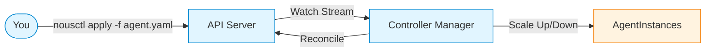

# Nous — Control Plane for AI Agents

> **"The mind that orchestrates minds."**

Nous (Greek: *mind*, *intellect*) is an open-source AI agent orchestration system — the control plane for AI agents. It applies proven Kubernetes infrastructure patterns (declarative resources, reconciliation loops, self-healing) to AI agent management while introducing agent-specific primitives for cognitive state, semantic health evaluation, and multi-objective scheduling.

---

## What is Nous?

Nous is **not** a Kubernetes operator. It is a **standalone control plane** — runtime-agnostic, managing agents across ECS, Lambda, VMs, and edge devices without locking you into Kubernetes.



**The Kubernetes UX Model** — without the Kubernetes lock-in:

```bash
# Apply a resource — same as kubectl
nousctl apply -f researcher.yaml

# Inspect state — same as kubectl
nousctl get agentdefinitions
nousctl describe agentdefinition researcher
nousctl get agentinstances --namespace production

# Delete a resource
nousctl delete agentdefinition researcher
```

---

## Why Not Just Use Kubernetes?

| Aspect | Containers (Kubernetes) | Agents (Nous) |
|--------|-------------------------|---------------|
| **Determinism** | Same input → same output | Probabilistic (LLM non-determinism) |
| **State** | Externalized (ConfigMaps, Secrets) | Complex cognitive state (context window, reasoning history) |
| **Health Checks** | Binary (TCP/HTTP probe) | Semantic (quality score, cost ceiling, coherence) |
| **Scheduling** | Bin packing (CPU, memory) | Multi-objective (cost, quality, latency) |
| **Failure Recovery** | Restart container | Checkpoint restoration, reasoning state recovery |
| **Scaling Metric** | CPU utilization | Queue depth, quality threshold, cost budget |

Container orchestration patterns don't map 1:1 to cognitive workloads.

---

## Quick Start

1. Define an Agent

    ```yaml
    # researcher.yaml
    apiVersion: nousproj.ai/v1alpha1
    kind: AgentDefinition
    metadata:
      name: researcher
      namespace: default
      labels:
        team: research
        tier: premium
    spec:
      model:
        provider: anthropic
        name: claude-sonnet-4
      tools:
        - name: web-search
        - name: document-retrieval
      scaling:
        minInstances: 1
        maxInstances: 5
        desiredInstances: 2
    ```

2. Apply it

    ```bash
    # Start local environment
    docker-compose up -d

    # Apply your AgentDefinition
    nousctl apply -f researcher.yaml

    # Watch the controller reconcile
    nousctl get agentinstances --watch
    ```

3. Submit a Task

    ```yaml
    # task.yaml
    apiVersion: nousproj.ai/v1alpha1
    kind: AgentTask
    metadata:
      name: quarterly-report-analysis
      namespace: default
    spec:
      agentRef: researcher
      input: "Analyze Q4 2025 earnings reports for tech sector"
      constraints:
        timeout: 30m
        budget: 2.00
    ```

---

## Repository Layout

```
nousproj/
├── nous-proto/              # Protobuf contracts (source of truth)
├── nous-api-server/         # gRPC + REST API, DynamoDB storage
├── nous-controller-manager/ # AgentController reconciliation loop
├── nous-scheduler/          # Multi-objective scheduler
├── nous-node-supervisor/    # Per-node agent lifecycle management
├── nous-agent-runtime/      # Agent execution environment
├── nous-infra/              # Pulumi IaC (AWS deployment)
└── nous-docs/               # This documentation site
```

---

## Implementation Status

| Component | Phase | Status |
|-----------|-------|--------|
| **nous-proto** — v1alpha1 types + gRPC API | Phase 1 | ✅ Complete |
| **nous-api-server** — gRPC + REST + DynamoDB | Phase 1 | ✅ Complete |
| **nous-controller-manager** — AgentController | Phase 1 | ✅ Complete |
| **nous-infra** — Pulumi DynamoDB + ECS | Phase 1 | Planned |
| **nous-scheduler** — Multi-objective scheduling | Phase 2 | ✅ Complete |
| **nous-node-supervisor** — Node lifecycle | Phase 2 | ✅ Complete |
| **nous-agent-runtime** — Agent execution | Phase 2 | ✅ Complete |

---

## Documentation Guide

| Section | Description |
|---------|-------------|
| [Architecture](architecture/visual-architecture.md) | Visual diagrams of system components and data flow |
| [Components](components/nous-api-server.md) | Per-service deep dives |
| [ADRs](adr/001-standalone-control-plane.md) | Architecture Decision Records — the *why* behind every major choice |
| [Phase 1](phase-1/README.md) | Implementation sequence and acceptance criteria |
| [Analysis](analysis/cycle-analysis.md) | Dependency cycle analysis |
